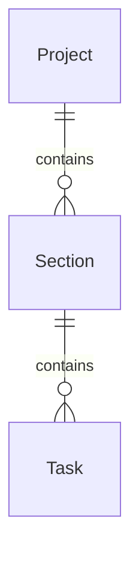

# Orlune

Orlune es una aplicación de gestión de proyectos basada en tableros Kanban, desarrollada con TypeScript, Express, Prisma y PostgreSQL.

El proyecto sigue una arquitectura por capas y aplica buenas prácticas de diseño de APIs, validación de datos y persistencia.


## Visión del proyecto

El objetivo a largo plazo de Orlune es convertirse en una plataforma que permita a profesionales, emprendedores y pequeños negocios crear, personalizar y gestionar su presencia online mediante herramientas impulsadas por inteligencia artificial.

Actualmente, el desarrollo se centra en la construcción de una API para la gestión de proyectos basada en tableros Kanban. Este módulo constituye la base sobre la que se desarrollarán el resto de funcionalidades de la plataforma.


## Estado del proyecto

🚧 Orlune se encuentra actualmente en fase de desarrollo.

En esta primera etapa se está construyendo la API y el modelo de datos que servirán de base para las futuras funcionalidades de la plataforma.


## Características

Actualmente la aplicación permite:

- Crear proyectos.
- Crear automáticamente una sección Backlog para cada proyecto.
- Listar proyectos.
- Listar las secciones de un proyecto.
- Crear nuevas secciones.
- Crear tareas dentro de una sección.
- Validación de datos mediante Zod.
- Gestión centralizada de errores HTTP.
- Persistencia mediante PostgreSQL y Prisma ORM.
  

## Tecnologías

- TypeScript
- Node.js
- Express
- Prisma ORM
- PostgreSQL
- Zod
- pnpm


## Arquitectura

La API sigue una arquitectura por capas:

```text
HTTP Request
    │
    ▼
Route
    ▼
Controller
    ▼
Service
    ▼
Repository
    ▼
Prisma
    ▼
PostgreSQL
```

Cada capa tiene una única responsabilidad:

- Controller: gestiona las peticiones HTTP.
- Service: contiene la lógica de negocio.
- Repository: encapsula el acceso a la base de datos.
- Prisma: acceso tipado a PostgreSQL.


## Estructura del proyecto

```text
apps/
└── api/
    ├── controllers/
    ├── services/
    ├── repositories/
    ├── routes/
    ├── middleware/
    └── prisma/

packages/
└── shared/
    └── schemas/
```
El paquete `shared` contiene los esquemas de validación y los tipos compartidos entre las distintas aplicaciones del monorepo.


## Modelo de datos

El dominio de la aplicación se organiza mediante una relación jerárquica entre proyectos, secciones y tareas.




## Instalación

```bash
pnpm install

pnpm --filter @orlune/shared build

pnpm --filter @orlune/api exec prisma migrate dev

pnpm --filter @orlune/api dev
```


## Scripts

| Comando | Descripción |
|----------|-------------|
| pnpm --filter @orlune/api dev | Inicia la API |
| pnpm --filter @orlune/api build | Compila la API |
| pnpm --filter @orlune/shared build | Compila el paquete shared |
| pnpm --filter @orlune/api exec prisma studio | Abre Prisma Studio |


## Roadmap

### Backend

- [x] Gestión de proyectos
- [x] Gestión de secciones
- [x] Gestión de tareas
- [ ] Listado de tareas por sección
- [ ] Actualización de tareas
- [ ] Movimiento de tareas entre secciones
- [ ] Eliminación de tareas


### Frontend

- [ ] Aplicación web
- [ ] Editor Kanban


### Plataforma

- [ ] Autenticación
- [ ] Integración con IA


## Principios de diseño

Durante el desarrollo de Orlune se han seguido los siguientes principios:

- Separación de responsabilidades mediante una arquitectura por capas.
- Validación de datos en tiempo de ejecución con Zod.
- Acceso a datos centralizado mediante el patrón Repository.
- Tipado compartido entre aplicaciones mediante el paquete `shared`.
- Control de versiones mediante Git con ramas por funcionalidad y commits atómicos.


## Metodología de desarrollo

Orlune se desarrolla de forma incremental, incorporando cada funcionalidad en una rama independiente.

Antes de integrarse en la rama principal, cada cambio se implementa, se valida manualmente y se revisa para mantener una arquitectura consistente y un historial de Git limpio.
Eso transmite una forma de trabajar profesional sin dejar de ser completamente cierto.


## Licencia

Este proyecto se distribuye bajo la licencia MIT.


