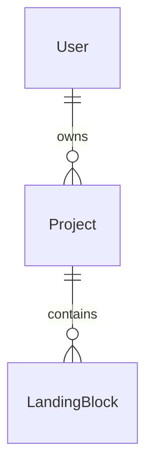

# Orlune

Orlune es un **landing-page builder full-stack** que permite crear y editar páginas mediante bloques reutilizables y persistir su contenido en base de datos.

Está desarrollado con React, TypeScript, Node.js, Express, Prisma y PostgreSQL, dentro de un monorepo con tipos y esquemas de validación compartidos entre frontend y backend.

> 🚧 Proyecto actualmente en desarrollo.

## Características

Actualmente Orlune permite:

- Registro e inicio de sesión.
- Autenticación mediante JWT.
- Rutas protegidas en el frontend.
- Creación y gestión de proyectos.
- Landing builder asociado a cada proyecto.
- Añadir bloques `Hero` y `CTA`.
- Seleccionar y editar bloques.
- Eliminar y reordenar bloques.
- Guardar una landing en PostgreSQL.
- Recuperar su contenido y orden después de recargar.
- Autorización de recursos por usuario.
- Validación de datos mediante Zod.
- Gestión centralizada de errores HTTP.

## Stack

### Frontend

- React
- TypeScript
- Vite
- React Router
- TanStack Query
- Zod

### Backend

- Node.js
- Express
- TypeScript
- Prisma ORM
- PostgreSQL
- JWT
- Argon2
- Zod

### Tooling

- pnpm
- pnpm workspaces
- Git

## Arquitectura

### Backend

La API sigue una arquitectura por capas:

```text
HTTP Request
    │
    ▼
Route
    │
    ▼
Controller
    │
    ▼
Service
    │
    ▼
Repository
    │
    ▼
Prisma
    │
    ▼
PostgreSQL
```

Cada capa mantiene una responsabilidad concreta:

- **Route:** define endpoints y aplica middleware.
- **Controller:** gestiona la entrada y salida HTTP.
- **Service:** contiene la lógica de negocio.
- **Repository:** encapsula el acceso a datos.
- **Prisma:** proporciona acceso tipado a PostgreSQL.

### Frontend

El frontend diferencia entre **server state** y **estado local**.

TanStack Query gestiona los datos procedentes de la API, su caché y las mutations de persistencia. React mantiene el estado local del editor mientras el usuario modifica la landing.

```text
PostgreSQL
    │
    ▼
API
    │
    ▼
TanStack Query
    │
    ▼
LandingEditor
    │
    ▼
Local draft
    │
    │ Save
    ▼
Mutation
    │
    ▼
API
```

El editor utiliza **discriminated unions** de TypeScript para modelar los distintos tipos de bloques de forma segura.

Los contratos principales se definen mediante Zod en `@orlune/shared` y se comparten entre frontend y backend.

## Estructura

Orlune utiliza un monorepo con pnpm workspaces:

```text
apps/
├── api/
│   ├── prisma/
│   └── src/
│       ├── controllers/
│       ├── services/
│       ├── repositories/
│       ├── routes/
│       └── middleware/
│
└── web/
    └── src/
        ├── features/
        │   └── landing-builder/
        ├── pages/
        ├── router/
        └── lib/

packages/
└── shared/
    └── src/
        └── schemas/
```

## Modelo de datos

Cada usuario puede tener varios proyectos y cada proyecto almacena los bloques que forman su landing page.


```mermaid
erDiagram
    User ||--o{ Project : owns
    Project ||--o{ LandingBlock : contains
```

Los bloques almacenan su tipo, contenido y posición, permitiendo reconstruir la landing manteniendo el orden definido en el editor.

## API del Landing Builder

```text
GET /projects/:projectId/landing
PUT /projects/:projectId/landing
```

El guardado de una landing se realiza mediante una transacción y el backend comprueba que el proyecto pertenece al usuario autenticado.

## Instalación

Instalar dependencias:

```bash
pnpm install
```

Compilar el paquete compartido:

```bash
pnpm --filter @orlune/shared build
```

Aplicar migraciones:

```bash
pnpm --filter @orlune/api exec prisma migrate dev
```

Iniciar el backend:

```bash
pnpm --filter @orlune/api dev
```

Iniciar el frontend:

```bash
pnpm --filter @orlune/web dev
```

## Scripts

| Comando | Descripción |
| --- | --- |
| `pnpm --filter @orlune/web dev` | Inicia el frontend |
| `pnpm --filter @orlune/web build` | Compila el frontend |
| `pnpm --filter @orlune/api dev` | Inicia la API |
| `pnpm --filter @orlune/api build` | Compila la API |
| `pnpm --filter @orlune/shared build` | Compila el paquete shared |
| `pnpm --filter @orlune/api exec prisma studio` | Abre Prisma Studio |

## Roadmap

### Completado

- [x] Registro y login
- [x] Autenticación JWT
- [x] Gestión de proyectos
- [x] Autorización por usuario
- [x] Bloques Hero y CTA
- [x] Edición de contenido
- [x] Eliminación y reordenación de bloques
- [x] Persistencia del landing builder
- [x] Recuperación de landings guardadas

### Próximos pasos

- [ ] Interfaz visual del editor
- [ ] Preview de la landing
- [ ] Nuevos tipos de bloques
- [ ] Publicación de landing pages
- [ ] URL pública para cada landing
- [ ] Deploy
- [ ] Integración con IA

## Desarrollo

Orlune se desarrolla de forma incremental mediante ramas de funcionalidad.

Antes de integrar una feature en `main`, los cambios se validan manualmente y se compilan los paquetes afectados para mantener una arquitectura consistente y un historial de Git limpio.


## Licencia

Este proyecto se distribuye bajo la licencia MIT.


